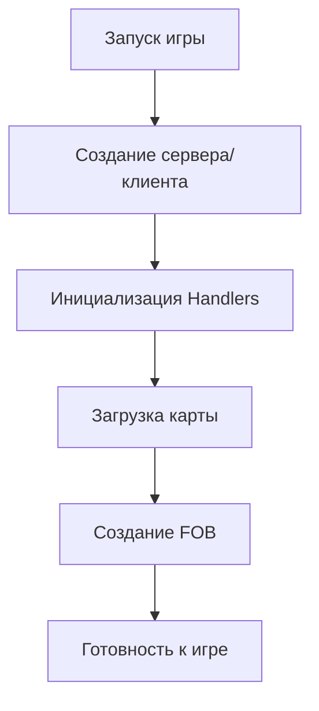
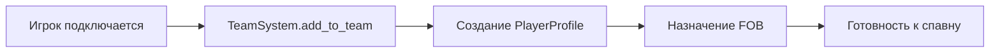
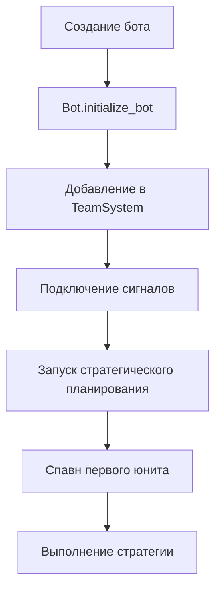
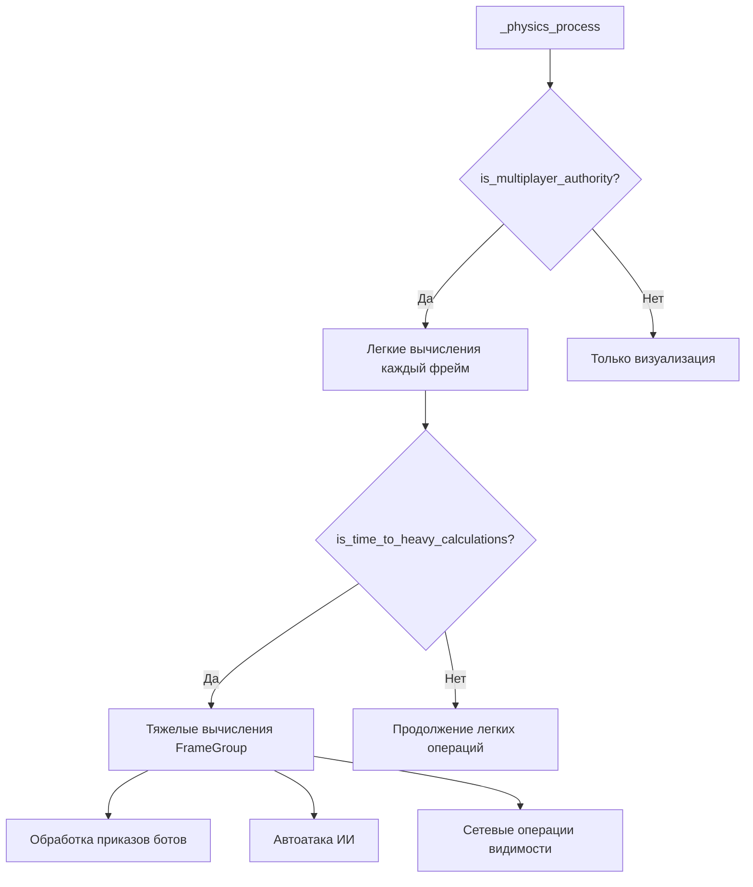
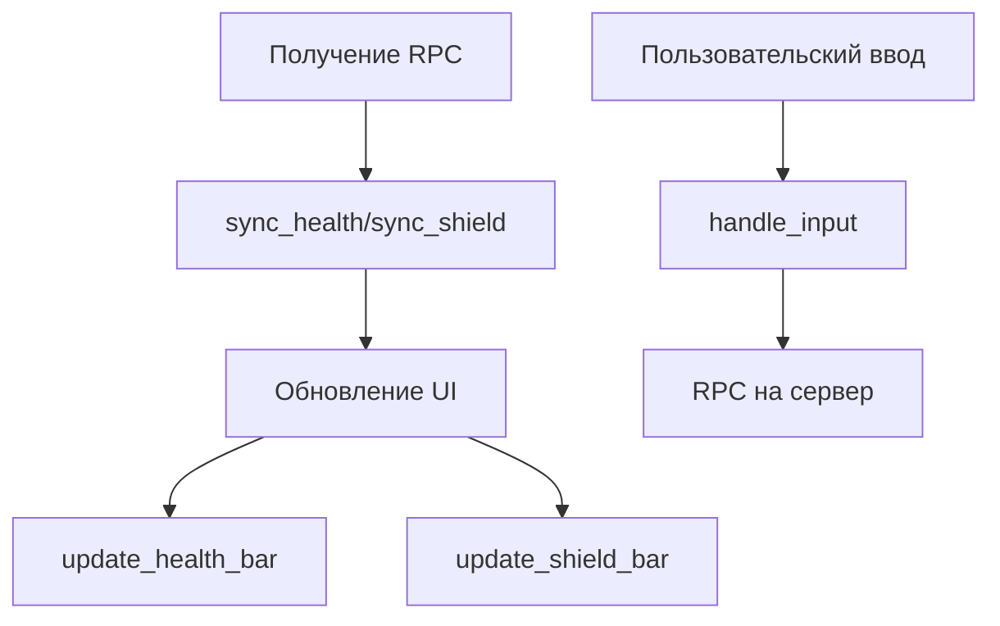
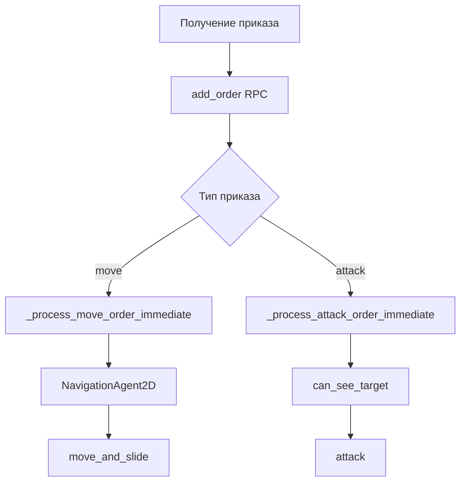
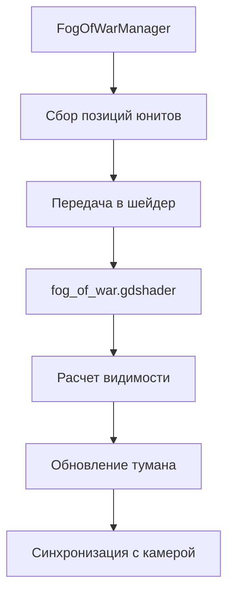
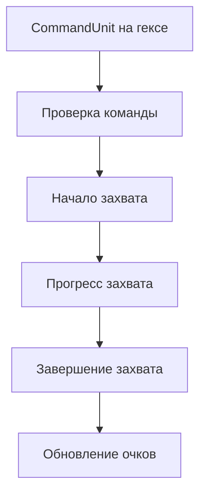
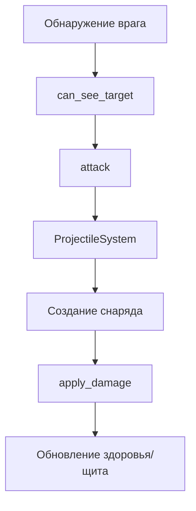
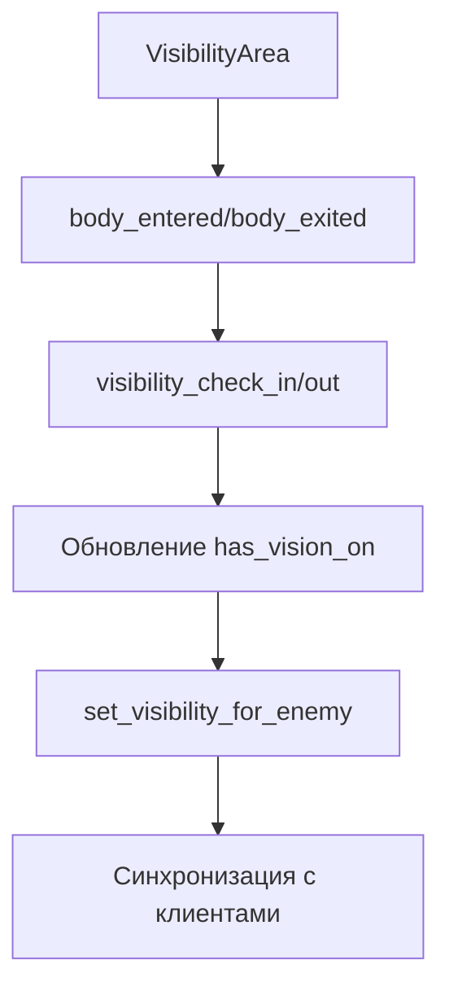

# SimpleRTS - Архитектура и логика работы

## 🎯 Обзор проекта

**SimpleRTS** - казуальная 2D мультиплеерная RTS с гексагональными картами, разработанная на Godot 4. Проект использует серверную архитектуру с клиентской визуализацией.

### Основные особенности
- **Гексагональная карта** с системой захвата территорий
- **Мультиплеерная игра** с поддержкой ботов
- **Система тумана войны** на основе шейдеров
- **ИИ боты** с стратегическим планированием
- **Оптимизированная производительность** для 500+ юнитов

## 🎯 Статус: ГОТОВО К ТЕСТИРОВАНИЮ

Архитектурная реорганизация завершена! Система спавна обновлена для автоматического назначения правильных скриптов.

### 🚀 Новые возможности

**Динамическое назначение скриптов:**
- Серверные инстанции автоматически получают `base_unit_server.gd`
- Клиентские инстанции автоматически получают `base_unit_client.gd`
- Префабы больше не содержат привязанные скрипты

**Система спавна:**
- `spawner_synchronizer.gd` определяет роль инстанции при создании
- Автоматическое разделение серверной и клиентской логики
- Сохранена полная совместимость с существующими системами

---

## 🏗️ Архитектура системы

### 📁 Структура файлов

```
scripts/
├── base_unit_server.gd      # Серверная логика юнитов
├── base_unit_client.gd      # Клиентская логика юнитов
├── bot.gd                   # Система ИИ ботов
├── game_system/             # Игровые системы
│   ├── team_system.gd       # Управление командами
│   ├── unit_spawner.gd      # Спавн юнитов
│   └── team.gd              # Класс команды
├── networking/              # Сетевая архитектура
│   ├── server/              # Серверная часть
│   ├── client/              # Клиентская часть
│   ├── synchronizer.gd      # Синхронизация данных
│   └── spawner_synchronizer.gd # Синхронизация спавна
├── singletons/              # Глобальные системы
│   ├── handlers.gd          # Центральный менеджер
│   ├── FrameGroup.gd        # Система распределения нагрузки
│   └── game_types.gd         # Типы и константы
└── UI/                      # Пользовательский интерфейс
```

## 🔄 Цепочки вызова и логика работы

### 1. 🚀 Инициализация игры



**Ключевые компоненты:**
- **`Handlers`** - центральный менеджер всех систем
- **`TeamSystem`** - управление командами игроков
- **`GameHandler`** - основная игровая логика
- **`FrameGroup`** - распределение нагрузки по фреймам

### 2. 👥 Система команд



**Логика работы:**
1. **Подключение игрока** → `TeamSystem.request_to_add_to_team()`
2. **Создание профиля** → `PlayerProfile.init(player_id, team)`
3. **Назначение FOB** → Поиск свободного FOB для команды
4. **Инициализация** → Готовность к спавну юнитов

### 3. 🤖 Система ботов



**Стратегии ботов:**
- **`expand`** - захват нейтральных гексов
- **`defend`** - группировка для защиты
- **`attack`** - координированные атаки

### 4. ⚔️ Система юнитов

#### Серверная логика (`BaseUnitServer`)



**Ключевые функции:**
- **`_physics_process`** - основной цикл (профилируется)
- **`_process_heavy_server_calculations`** - тяжелые вычисления
- **`attack`** - система атак (профилируется)
- **`_get_visible_enemies`** - поиск врагов (профилируется)

#### Клиентская логика (`BaseUnitClient`)



**RPC коммуникация:**
- **Сервер → Клиент**: `sync_health`, `sync_shield`, `set_unit_info`
- **Клиент → Сервер**: `add_order`, `get_unit_info`, `clear_orders`

### 5. 🎯 Система приказов



**Особенности обработки:**
- **Игроки**: Мгновенная обработка каждый фрейм
- **Боты**: Отложенная обработка через FrameGroup
- **Навигация**: Умные алгоритмы обхода препятствий

### 6. 🌫️ Система тумана войны



**Технические детали:**
- **Шейдерный туман** вместо множественных Light объектов
- **Uniform массивы** для передачи позиций юнитов
- **Синхронизация с камерой** через сигналы

## 📊 Система профилирования

### Встроенные метрики

```gdscript
# В base_unit_server.gd:
func _profile_function_start(function_name: String) -> void
func _profile_function_end(function_name: String) -> void
func get_profile_stats() -> Dictionary
func log_profile_stats() -> void
```

### Использование

```gdscript
# В консоли Godot (Debug → Remote Debug):
unit.log_profile_stats()

# Пример вывода:
=== ПРОФИЛЬ ПРОИЗВОДИТЕЛЬНОСТИ ЮНИТА BaseUnit ===
  _physics_process: 1250 вызовов, среднее время: 0.002с, макс: 0.015с
  _process_heavy_server_calculations: 25 вызовов, среднее время: 0.008с, макс: 0.012с
  _get_visible_enemies: 125 вызовов, среднее время: 0.001с, макс: 0.003с
  attack: 15 вызовов, среднее время: 0.0005с, макс: 0.001с
=== КОНЕЦ ПРОФИЛЯ ===
```

## 🔧 Оптимизации производительности

### 1. FrameGroup система

```gdscript
# Распределение юнитов по группам для обработки
func is_time_to_heavy_calculations() -> bool:
    return (Engine.get_physics_frames() % Handlers.FrameGroupHandler.num_groups) == frame_group
```

**Принцип работы:**
- Юниты распределяются по группам (по умолчанию 60 групп)
- Каждый фрейм обрабатывается только одна группа
- Снижение нагрузки в ~60 раз

### 2. Кэширование

```gdscript
# Кэш видимости врагов (5 фреймов)
if cached_result_is_fresh():
    return cached_result

# Кэш команд юнитов
func _get_cached_team():
    if owner_team != null:
        return owner_team
```

**Оптимизации:**
- **Кэш видимости** - обновление каждые 10 фреймов
- **Кэш врагов** - сохранение на 5 фреймов
- **Кэш команд** - избежание повторных поисков

### 3. Умное разделение логики

```gdscript
# Легкие операции каждый фрейм
_quick_visibility_check()
move_and_slide()

# Тяжелые операции через FrameGroup
if is_time_to_heavy_calculations():
    _process_heavy_server_calculations(delta)
```

## 🌐 Сетевая архитектура

### RPC методы

#### Сервер → Клиент
- **`sync_health`** - синхронизация здоровья
- **`sync_shield`** - синхронизация щита
- **`set_unit_info`** - информация о профиле юнита

#### Клиент → Сервер
- **`add_order`** - добавление приказа
- **`get_unit_info`** - запрос информации о юните
- **`clear_orders`** - очистка приказов

### Синхронизация данных

```gdscript
# В MultiplayerSynchronizer:
properties/0/path = NodePath(".:position")
properties/1/path = NodePath(".:rotation")
properties/2/path = NodePath(".:health")
properties/3/path = NodePath(".:shield")
properties/4/path = NodePath(".:owner_id")
properties/5/path = NodePath(".:UID")
```

## 🎮 Игровые механики

### 1. Захват гексов



### 2. Система атак



### 3. Система видимости



## 🚀 Масштабируемость

### Готовность к нагрузке

- **500+ юнитов** одновременно на карте
- **FrameGroup система** для распределения нагрузки
- **Кэширование** для снижения повторных вычислений
- **Профилирование** для точной оптимизации

### Мониторинг производительности

1. **Используйте профайлер Godot** (`Debug` → `Profiler`)
2. **Анализируйте CPU Usage** - ищите функции с высоким Total time
3. **Следите за Frame Time** - пики выше 16.67ms = лаги
4. **Применяйте встроенное профилирование** для детального анализа

## 📚 Дополнительные ресурсы

- **`PROFILING_GUIDE.md`** - подробное руководство по профилированию
- **`.wiki/changelog.md`** - история изменений проекта
- **`scripts/`** - исходный код с подробными комментариями

## 🔧 Разработка

### Добавление новых функций

1. **Определите модуль** - серверная или клиентская логика
2. **Добавьте профилирование** для критических функций
3. **Используйте RPC** для синхронизации данных
4. **Тестируйте производительность** с большим количеством юнитов

### Отладка проблем

1. **Используйте встроенное профилирование** для поиска узких мест
2. **Анализируйте логи** в консоли Godot
3. **Проверяйте сетевую синхронизацию** через Remote Debug
4. **Тестируйте с ботами** для создания нагрузки

---

*Архитектура SimpleRTS спроектирована для максимальной производительности и масштабируемости при сохранении простоты разработки и отладки.*
